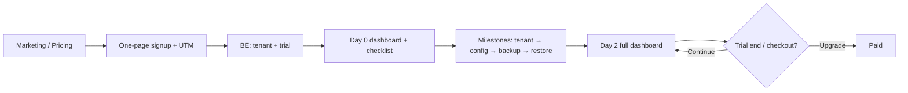

# PLG & Start Trial — Frontend Interview Revision

**Round focus:** Project/product you worked on, problems you faced, how you solved them.  
**Your angle:** Frontend engineer on a **product-led growth (PLG)** squad — especially **Start Trial** and self-serve signup → activation → conversion.

Use this doc to rehearse out loud. Fill in `[BRACKETS]` with your real product names, metrics, and stack.

**Reference (Druva PLG):** [From Strategy to Execution: Implementing Product-Led Growth in Druva](https://www.druva.com/blog/implementing-product-led-growth-in-druva) (July 2024)

---

## 1. Elevator pitch (30 seconds)

> I'm a frontend engineer on the **PLG / self-serve trial** team at **Druva** (Data Security Cloud). We moved many **SMB trials** off Sales-Engineer–provisioned POCs to a **product-led** path: frictionless signup → tenant creation → **Day 0 onboarding** (checklist, dashboard) → first backup/restore → trial status & upgrade. I work on signup UX, onboarding UI (checklist, Day 0 → Day 2 dashboard), trial banners, integrations (tours, chat), UTM/attribution in the funnel, and client-side telemetry hooks—always paired with backend APIs for tenant state, milestones, and lead sync to Marketo/Salesforce.

**Keywords to drop naturally:** self-serve, trial, activation, time-to-value, funnel, entitlement, experiment, conversion.

---

## 2. What is PLG? (interviewer may ask)

| Sales-led | Product-led (your world) |
|-----------|---------------------------|
| Demo → contract → access | Sign up / **start trial** → use product → upgrade |
| Sales qualifies | Product + data qualify (usage, limits hit) |
| Long cycle | Faster loop; frontend is the “storefront + checkout + showroom” |

**Frontend’s role in PLG**

1. **Reduce friction** — fewer steps to trial, clear CTAs, fast signup (SSO, email magic link).
2. **Drive activation** — onboarding, empty states, checklists, “aha” moments in UI.
3. **Surface limits & upgrade** — trial banners, paywalls, usage meters, upgrade modals at the right moment.
4. **Measure everything** — events on trial start, step completion, feature use, upgrade click.

**Metrics you should know (even if analytics owned them)**

| Metric | Meaning |
|--------|---------|
| **Trial start rate** | Visitors / signups who click “Start trial” and land in app |
| **Activation rate** | Trial users who hit a defined “activated” event (e.g. first project, first integration) |
| **Time to value (TTV)** | Time from trial start → first meaningful outcome |
| **Trial → paid conversion** | % of trials that become paying |
| **PQL (product-qualified lead)** | Usage signals that trigger sales assist (you may only **display** or **tag** these in UI) |
| **NNL (net new logo)** | New customer account — key PLG goal at Druva |
| **CAC** | Customer acquisition cost — PLG aims to lower it for SMB |
| **ARR** | Annual recurring revenue — used to justify PLG vs SE-led POCs |
| **SLG** | Sales-led growth — demos, SE provisioning; PLG **complements**, not replaces |

---

## 3. Druva PLG — strategy, trial motion & full-stack pillars

Source: [Druva PLG blog](https://www.druva.com/blog/implementing-product-led-growth-in-druva). Know the **business why** and **who owns what** (FE vs BE vs platform).

### 3.1 Why Druva moved to PLG

| Before (SLG-heavy) | Problem | PLG response |
|--------------------|---------|--------------|
| SEs run most **POCs** (proof of concept) | **66%** of SE POCs were **SMB**, but SMB = only **~14% ARR** | SE bandwidth spent on low-yield motion |
| Sales proportional to **# of SEs** | Hard to scale SaaS growth | **Self-serve trial**: user experiences product end-to-end with minimal hand-holding |

**PLG vision at Druva:** Customer goes **start → finish** in product with minimal external help. Frees Sales from provisioning tenants and basic education; gives SMB a **simpler, self-serve** experience.

**Primary goals (memorize for interviews):**

1. **Expand user base** — net new logos (NNL), more active users  
2. **Scale SMB efficiently** — growth with **lower CAC**  
3. **Eliminate friction** — seamless, intuitive adoption  
4. **Complement SLG** — PLG + sales work **together** (e.g. high-intent PLG leads to AE/SE)

**Approach:** Iterative **“crawl, walk, run”** — ship, measure telemetry, improve.

### 3.2 Trial motion: SLG vs PLG (conceptual)

```mermaid
flowchart TB
  subgraph SLG["Sales-Led (legacy SMB POC)"]
    L1[Lead] --> L2[AE/SE engagement]
    L2 --> L3[SE provisions tenant]
    L3 --> L4[Guided POC]
    L4 --> L5[Contract]
  end
  subgraph PLG["Product-Led (self-serve)"]
    P1[Marketing / pricing] --> P2[One-page signup]
    P2 --> P3[Auto tenant + trial]
    P3 --> P4[Day 0 dashboard + checklist]
    P4 --> P5[Product tours + chat]
    P5 --> P6[Activation milestones]
    P6 --> P7[Telemetry + leads in SFDC/Marketo]
    P7 --> P8[Checkout / upgrade - roadmap]
  end
```



### 3.3 Pillar 1 — Sign-up

**Product intent:** One-page, **minimal fields**; fast path to trial. Optional enrichment (e.g. ZoomInfo) for auto-fill—not blocking the user on region/timezone pickers.

| Area | Frontend (your lane) | Backend / platform |
|------|----------------------|-------------------|
| **Form UX** | Single page, validation, loading/errors, redirect to app | Create user, tenant, trial entitlements |
| **Reliability** | Retry UI, “account creating…”, handle expired activation links | Unique customer name suffixes on collision; **regenerate activation links** on expiry |
| **Marketing** | Read `utm_*` from URL → persist (session/cookie) → attach to signup/analytics payload | Store UTMs on lead/account for attribution |
| **Lead segmentation** | Collect/display: company, size, title, country (only what’s required) | Persist for Marketo/SFDC segmentation |
| **Abuse prevention** | **Captcha** on submit; generic error copy (no “email already exists” leak) | Email domain **blocklist** (public domains); **per-domain signup limits**; **WAF** / rate limits |
| **Security UX** | Don’t expose whether an email is registered to anonymous users | Auth, throttling, secure APIs |

**Interview line:** “On signup I cared about **conversion and safe errors**—captcha and copy on the UI; **trust and limits** lived on the API and WAF.”

**Self-serve signup (public reference):** [druva.com free trial / get started](https://www.druva.com) (pricing & trial CTAs on marketing site).

### 3.4 Pillar 2 — Onboarding

**Frameworks mentioned at Druva:** Bowling Alley (primary), plus ideas from C.A.R.E. and EMBED — guide users through **milestones** toward core value.

#### Day 0 vs Day 2 dashboard

| Phase | UX goal | Frontend |
|-------|---------|----------|
| **Day 0** | Actionable, **minimal distraction** — clear next steps to get started fast | Simplified dashboard layout, prominent CTAs, maybe hide advanced chrome |
| **Day 2+** | User completed key steps → show **full product** + usage views | Conditional layout when milestone API says “onboarding phase = day2” |

**Backend:** Milestone/completion flags (tenant registered, backup configured, etc.) drive which dashboard variant to render.

#### Checklist (core PLG UI)

Always visible or **one click away**. Shows:

- Trial status: **In progress / Expired**  
- **Days remaining**  
- Milestones: **done vs pending**

**Druva activation milestones (know these):**

1. Tenant registration  
2. Backup configuration  
3. **First backup completed** (backend-driven)  
4. **First restore completed** (backend-driven)  

| | Frontend | Backend |
|---|----------|---------|
| **User-driven steps** | Navigate user to config screens; mark complete on successful UI action | Validate config exists |
| **Job-driven steps** (backup/restore) | Poll or subscribe to job status APIs; update checklist when complete | Backup/restore pipelines emit state |
| **Build vs buy** | Custom checklist using **existing APIs** (Druva chose this for BE-driven items) | Avoid syncing every job to a third-party checklist SaaS |

**Why not only a checklist SaaS?** Third-party tools work when items are **UI-only**. Druva’s “first backup complete” is **backend truth**—faster to render from product APIs than wire backup jobs into an external tool.

#### Product tours (Storylane)

| Frontend | Backend / growth |
|----------|------------------|
| Embed tour launcher, pass user/lead context if needed | — |
| Link from onboarding empty states | — |
| — | **Marketo** integration: tour progress → lead scoring, nurture |

**Storylane (why Druva picked it):** HTML snapshots, no-code edits, blur sensitive data, highlight/zoom — lets prospects **explore without real data**.

Public tours: [Druva product tours](https://www.druva.com) (learning center / product tours on site).

#### Chat support (Intercom)

| Frontend | Backend / ops |
|----------|----------------|
| Embed Intercom widget; pass user, trial day, checklist state as **custom attributes** | **Salesforce**: transcripts on contact, case creation |
| Contextual help entry points in UI | Bot → **handoff to TSE**; docs/playbooks in chat |
| — | Calendar scheduling, in-app nudges, reporting |

**Interview line:** “Without AE/SE on every trial, **tours + chat** are the substitute for white-glove demo—frontend wires context so support isn’t blind.”

### 3.5 Pillar 3 — Lead generation

**Goal:** Capture product interest at signup, in tours, and **in-product** → **Marketo** + **Salesforce**.

| Frontend | Backend / integrations |
|----------|-------------------------|
| Fire events: signup complete, tour started/completed, checklist milestone | Lead/account APIs, sync jobs |
| Pass UTMs + segmentation fields on signup | Lead owner rules from UTM (PLG + **SLG coexistence**) |
| “Contact sales” / upgrade CTAs | AE/SE queues for high-confidence leads |
| — | Segment by country, company size, workload interest |

**PLG-influenced leads:** Trials that started via **partner**, **SLG**, or other channels but used **self-serve experience** — telemetry tracks these separately for marketing/sales optimization.

### 3.6 Pillar 4 — Telemetry

**Goal:** Find drop-offs (e.g. configured backup but never **first backup complete**) and fix product + onboarding.

| Frontend | Backend / data |
|----------|----------------|
| Instrument funnel steps, screen views, CTA clicks, errors | Event pipeline, warehouses, dashboards |
| Consistent `event` schema with `trial_id`, `milestone`, `utm` | Correlate with backup/restore job success |
| Feature flags for experiments | PM/analytics owns metrics; engineering fixes friction |

**Example investigation (from blog):** Users configure workloads but stall before first backup/restore → team simplifies backup/restore UX and onboarding hints.

### 3.7 Roadmap (know for “what’s next” questions)

| Initiative | Frontend angle | Backend / biz |
|------------|----------------|---------------|
| **Checkout** | Trial expiry banners, purchase CTAs, checkout return URLs, post-pay entitlement refresh | Billing, subscriptions, webhooks |
| **PLG for partners / MSP** | Personalized signup links, partner-branded flows, lead attribution UI | Partner tenant model, lead tracking |

---

## 4. Start Trial — end-to-end flow (your core story)

Draw this mentally; walk the interviewer through it.



### 4.1 Where “Start Trial” appears (frontend touchpoints)

| Surface | What you built / care about |
|---------|----------------------------|
| **Pricing page** | Plan cards, “Start free trial” vs “Contact sales”, annual toggle, feature comparison |
| **Signup** | Email + password, Google/Microsoft SSO, invite vs self-serve |
| **Post-auth routing** | New user → onboarding; returning user → dashboard; wrong state → fix redirect |
| **Trial creation** | API call on first login; loading/error states; idempotency (double-click) |
| **App shell** | Trial badge, days left, “Upgrade” in header |
| **Onboarding** | Steps, progress, skip, resume later |
| **Feature gates** | Hide/disable premium actions; show upgrade modal instead of silent fail |
| **Billing** | Stripe/customer portal embed, plan picker, success/cancel return URLs |

### 4.2 Trial state on the client (typical model)

Backend is source of truth; frontend **reflects** and **caches carefully**.

```ts
// Example shape — align with your API
type TrialState = {
  status: 'none' | 'active' | 'expired' | 'converted';
  planId: string;
  trialEndsAt: string; // ISO
  daysRemaining: number;
  entitlements: string[]; // feature flags / SKUs
  usage?: { seats: number; limit: number };
};
```

**Frontend responsibilities**

- Fetch trial/entitlements after auth (bootstrap on app load).
- Store in **React context / Zustand / Redux** — not only localStorage (stale = wrong paywall).
- **Refetch** after: trial start, upgrade, admin changes, webhook-delayed updates (poll or SSE if needed).
- **Optimistic UI** only where rollback is safe (e.g. UI preference), not for billing.

### 4.3 “Start Trial” button — details interviewers like

- **Single primary CTA** per page; secondary = “Talk to sales” for enterprise.
- **Loading state** while `POST /trials` or `POST /workspaces` runs; disable double submit.
- **Error handling**: card required elsewhere, region blocked, email already has trial → clear copy + link to login.
- **Deep links**: `?plan=pro&source=pricing` preserved through signup (query → session → API).
- **Attribution**: UTM / `source` passed to analytics and sometimes to backend for funnel reports.

---

## 5. STAR stories — fill these in and practice

Use **Situation → Task → Action → Result**. Keep each story **2–3 minutes**.

### Story A — Start Trial funnel drop-off

| | |
|---|---|
| **S** | After launching new pricing, **trial starts dropped ~X%** from pricing page; PM suspected confusing plan copy, but drop was after signup. |
| **T** | Find where users abandoned and improve conversion to **first session in app**. |
| **A** | Instrumented funnel (pricing CTA → signup complete → trial API success → onboarding step 1). Found **spinner with no copy** after SSO and **redirect loop** for users with existing workspace. Fixed routing guard, added explicit “Creating your trial…” step, retried failed trial creation once. |
| **R** | Trial start rate **+X%**; support tickets for “stuck after login” **down**. |

**Frontend specifics to mention:** route guards, `useEffect` race with auth token, loading UX, Segment/Amplitude events.

---

### Story B — Feature gating & upgrade moment (PLG monetization)

| | |
|---|---|
| **S** | Trial users hit **seat / export / API** limits; backend returned `403` with opaque errors; users churned confused. |
| **T** | Make limits **visible** and turn limit-hit into **upgrade intent**, not dead end. |
| **A** | Built **entitlement hook** `useFeature('advanced_reports')` used across app. Unified **UpgradeModal** with plan comparison and trial days left. Soft gate: show preview + blur; hard gate: block action + CTA. Synced copy with PM for “value not punishment.” |
| **R** | Upgrade clicks from limit screens **+X%**; fewer “broken” support tickets. |

**Tech:** feature flag service (LaunchDarkly / internal), lazy-loaded modal, same component on pricing and in-app.

---

### Story C — Onboarding & activation (Druva checklist + Day 0 dashboard)

| | |
|---|---|
| **S** | Self-serve trials had no SE to guide them; telemetry showed drop-off **after backup config, before first backup complete**. |
| **T** | Ship **Bowling Alley** onboarding: Day 0 dashboard + checklist tied to real milestones (tenant → config → first backup → first restore). |
| **A** | Built persistent **checklist** (days left, in-progress/expired). Wired **user-driven** steps to routes; **job-driven** steps to milestone/backup APIs (not a third-party checklist SaaS). When milestones hit threshold, **auto-transition Day 0 → Day 2** dashboard. Embedded **Storylane** + **Intercom** from empty states. |
| **R** | First-backup completion rate **+X%**; fewer “stuck in trial” chats. |

### Story C2 — Signup / PLG security (optional)

| | |
|---|---|
| **S** | Signup failures and abuse (bots, duplicate public-email trials) hurt conversion and ops. |
| **T** | Harden funnel without hurting legitimate SMB signups. |
| **A** | **Captcha** on UI; generic errors (no account enumeration). Preserved **UTM** through redirect chain. Worked with platform on **domain limits** / blocklist—FE maps API errors to actionable copy. |
| **R** | Signup success rate up; abuse tickets down. |

---

### Story D — Cross-team / hard problem (pick one you lived)

Choose the closest:

- **Auth + trial race:** Token ready before `/me` returns trial → flash of wrong paywall. **Fix:** gate render on `authReady && entitlementsLoaded`.
- **Stale trial after payment:** Webhook lag; user paid but still saw “Trial expired”. **Fix:** polling after checkout success + `refetchEntitlements()` on focus.
- **i18n / accessibility:** Trial banner announced by screen readers; focus trap in upgrade modal.
- **Performance:** Pricing page LCP; code-split heavy comparison table.
- **Design system:** One `TrialBanner` in design system used marketing + app — consistent PLG messaging.

---

## 6. Problems & solutions — frontend PLG cheat sheet

| Problem | Symptom | Frontend solution |
|---------|---------|-------------------|
| **Trial not created** | User in app but no trial entitlements | Idempotent trial API on first login; error UI + retry; monitor `trial_create_failed` |
| **Wrong plan after signup** | User wanted Pro, got Starter | Pass `planId` through signup URL → sessionStorage → create-trial payload |
| **Paywall flash** | Premium UI flickers then hides | Don’t render gated routes until entitlements loaded; skeleton shell |
| **Double trial / abuse** | Same email many trials | Mostly backend; frontend: disable CTA + “Already have an account?” |
| **Expired trial UX** | Hard logout vs read-only | Product call: read-only mode + upgrade vs block; implement consistently |
| **SSO domain mismatch** | Work email required | Validate domain on signup form; clear error from API |
| **Analytics gaps** | Can’t trust funnel | One `analytics.track('trial_started', { plan, source })` at success boundary |
| **Experiments** | Two CTAs on pricing | Feature flag wrapper; expose `variant` in events |
| **Embeds / iframe billing** | Stripe Checkout redirect breaks | Return URLs, `postMessage` to parent if embedded admin |

---

## 7. Architecture talking points (senior signal)

### 7.1 Entitlements layer

```
AuthProvider → EntitlementsProvider → useFeature(name) → Component
```

- Centralize: no scattered `if (user.plan === 'trial')` in 50 files.
- Server components (Next.js): fetch entitlements on server for first paint when possible.
- **Fail closed** for dangerous actions; **fail open** only for non-billing cosmetic features (rare).

### 7.2 Routing & PLG

- Public: marketing, pricing, docs.
- Auth: signup, login, verify email.
- **Onboarding route group:** `/onboarding/*` only if `!activated`.
- **App:** `/app/*` requires auth + trial/active subscription.

### 7.3 Components you likely own (Druva-flavored)

| Component | Purpose |
|-----------|---------|
| `StartTrialButton` | CTA + loading + analytics |
| `TrialBanner` | Days left, upgrade link |
| `PlanSelector` | Pricing cards, feature matrix |
| `UpgradeModal` | In-context conversion |
| `UsageMeter` | Seats, API calls, storage |
| `OnboardingChecklist` | Four milestones + trial days + in-progress/expired |
| `Day0Dashboard` / `Day2Dashboard` | Layout switch when milestones complete |
| `TrialStatusBadge` | In progress / expired / days left |
| `SignupPage` | One-page form, captcha, UTM capture |
| `PaywallOverlay` | Soft/hard gate (checkout roadmap) |

### 7.4 Integrations at Druva (from blog — name what you touched)

| Tool | Role | Typical FE work |
|------|------|-----------------|
| **Storylane** | Product tours | Embed, launch from checklist/empty states |
| **Intercom** | Chat + nudges | Widget, user/trial attributes, help entry points |
| **Marketo** | Marketing automation | UTMs + events often via BE; FE fires client events |
| **Salesforce** | CRM / leads | Usually BE sync; FE may drive “request demo” |
| **ZoomInfo** (or similar) | Signup auto-fill | FE displays pre-filled fields from enrichment API |
| **Captcha** | Bot prevention | UI widget + token on submit |
| **WAF** | DOS / abuse | Transparent to FE except rate-limit error handling |

Also: internal **telemetry** pipeline, **backup/restore job APIs** for checklist state.

---

## 8. Questions they may ask — short answers

**Q: How do you decide what to gate vs give free in trial?**  
Product defines activation vs monetization. Frontend implements entitlements from API; we don’t hardcode business rules in UI without flags.

**Q: How do you measure success of a Start Trial change?**  
Primary: trial start rate, activation, trial→paid. Guardrails: signup error rate, page LCP, support volume. Always event at **trial_created** server-confirmed, not button click only.

**Q: Conflict with backend on trial state?**  
Backend wins. UI shows loading until consistent; after upgrade, refetch + optional short poll.

**Q: PLG vs sales-assisted?**  
Frontend shows “Contact sales” on enterprise plans; in-app may show “Talk to sales” when usage hits PQL thresholds (data from API).

**Q: Biggest mistake in PLG frontend?**  
Gating with client-only checks (bypassable) for security-sensitive features — always enforce on API; UI is for UX and conversion.

**Q: How do you work with PM / design / backend?**  
Figma for funnel → API contract for `Trial` / `Entitlement` → instrument events in same PR → launch behind flag → read dashboard with PM.

**Q: Why did Druva invest in PLG if Sales already works?**  
SE POCs were skewed to SMB (**66%** of POCs) with low ARR share (**~14%**). PLG scales trials without linear SE hiring and **complements SLG** for larger or high-intent deals.

**Q: How does checklist know “first backup complete”?**  
Not a button click alone—**backend job state** drives the milestone. FE polls or receives updated milestone API and re-renders checklist + may unlock **Day 2** dashboard.

---

## 9. Whiteboard / diagram they might ask you to draw

```
[Browser]
  PricingPage --(Start Trial)--> Signup --> API: createUser + startTrial
       |                                      |
       v                                      v
  analytics                          AppShell + TrialBanner
       |                                      |
       +------------ onboarding --------------+
                      |
                      v
              useFeature('X') --> false --> UpgradeModal --> Stripe
```

---

```
[Druva PLG - simplified]
  Pricing/Get Started
       → Signup (1 page, captcha, UTM, segmentation)
       → BE: tenant + trial + activation email
       → Day 0 Dashboard + Checklist
       → User: register tenant → configure backup
       → BE: first backup job → milestone API
       → FE: checklist ✓ → transition to Day 2 view
       → Storylane tour / Intercom if stuck
       → Telemetry → drop-off analysis
       → (Roadmap) Checkout / upgrade
```

---

## 10. Your checklist before the interview

- [ ] **Druva four milestones** + Day 0 / Day 2 dashboard behavior
- [ ] **Why PLG** (66% / 14% ARR story) and **complements SLG**
- [ ] Product name, **what the trial includes** (duration, workloads)
- [ ] **One metric** you moved (even approximate %)
- [ ] **Stack:** framework, state, auth, billing, analytics
- [ ] **2 STAR stories** minimum: Start Trial funnel + gating/onboarding
- [ ] **One failure:** what broke, how you debugged (Network tab, logs, feature flag)
- [ ] **Tradeoff:** e.g. aggressive upgrade prompts vs activation-first onboarding
- [ ] **What you’d do next:** e.g. personalized onboarding by `source`, in-app experiments

---

## 11. Quick glossary

| Term | One line |
|------|----------|
| **PLG** | Growth driven by product usage, not primarily outbound sales |
| **Self-serve** | User signs up and starts trial without a rep |
| **Activation** | User reached “first value” defined by the company |
| **Entitlement** | What features/plan the account is allowed to use |
| **Paywall** | UI that blocks or prompts upgrade |
| **PQL** | Lead qualified by product usage for sales follow-up |
| **TTV** | Time from signup/trial to first value |
| **North star (team)** | Often trial starts, activation, or trial→paid — know yours |

---

## 12. Customization worksheet (fill once, rehearse daily)

```text
Company / product: Druva Data Security Cloud
Team name:
Trial length & plans:

Druva milestones I worked on (check all you own UI for):
[ ] Tenant registration  [ ] Backup config  [ ] First backup  [ ] First restore

My main projects (3 bullets):
1. Signup / start trial:
2. Onboarding (checklist / Day 0 dashboard):
3. Integrations (Storylane / Intercom / telemetry):

Key API endpoints I integrated:
- POST signup / start trial:
- GET trial status / milestones / checklist:
- GET backup job status (for checklist):

Analytics events I own:
- signup_completed, milestone_*, tour_*, ...

Biggest win (metric):
-

Hardest bug (e.g. checklist stale until backup job completes):
-
```

---

## 13. Druva PLG — FE vs BE quick reference

| Pillar | You say on frontend | You acknowledge on backend |
|--------|---------------------|----------------------------|
| **Sign-up** | One-page UX, captcha, UTM capture, safe errors | Tenant provisioning, unique name suffix, activation links, blocklists, WAF |
| **Onboarding** | Day 0/2 UI, checklist, tours/chat embeds | Milestone APIs, backup/restore job state |
| **Lead gen** | Events + form fields | Marketo, Salesforce, lead owner from UTM |
| **Telemetry** | Instrument UI funnel | Pipeline, analysis, product fixes |
| **Checkout (future)** | Expiry UX, purchase flow | Billing, entitlements after pay |

---

*Good luck on the problem-solving round. Lead with **user outcome** (more trials, faster activation, clearer upgrade path), then **your frontend decisions** (state, routing, components, measurement).*
