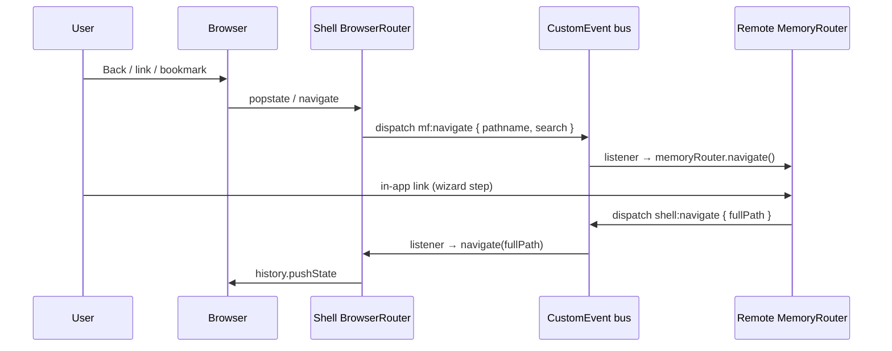

# Frontend — Problems Faced & How I Solved Them

**Use for:** Technical / problem-solving rounds, “tell me about a hard bug,” system design follow-ups.  
**Format:** Each section = **Problem → Context → Approach → Result → Interview line** (say the last line out loud).

Pair with [PLG & Start Trial](PLG-START-TRIAL-INTERVIEW.md) for product stories; this doc is **engineering depth**.

---

## How to tell these in an interview

1. **Situation** — one sentence (scale, stack, who was affected).
2. **Task** — what “good” looked like (correct URL, 60fps chart, no paywall flash).
3. **Action** — what _you_ did (design, code, tradeoffs).
4. **Result** — metric or qualitative win if you have it; otherwise “zero regressions / support tickets dropped.”

**Senior signals:** name tradeoffs, failure modes, observability, and what you’d do differently at 10× scale.

---

## 1. Routing with micro frontends (shell vs remote)

### Problem

We run a **host shell** (main product chrome, global nav) and **remote micro frontends** (feature teams ship independent bundles). Both need React Router, but:

| Layer         | Router          | Why                                                                                              |
| ------------- | --------------- | ------------------------------------------------------------------------------------------------ |
| **Shell**     | `BrowserRouter` | Real URL bar, back/forward, bookmarking, SEO on public routes                                    |
| **Remote MF** | `MemoryRouter`  | MF mounts in a container; must not hijack the browser URL or fight the shell’s route definitions |

**Symptoms without sync:** Back button exits the app instead of MF step; shell URL says `/reports` but MF still shows list view; deep links open shell but MF shows wrong screen; double `history.push` from both routers.

### Context

- Shell owns **top-level segments** (`/app/reports/*`, `/app/backup/*`).
- MF owns **internal steps** (`/list`, `/detail/:id`, wizard steps) **under** that mount point.
- Users expect one coherent history stack.

### Approach — custom history bridge

Treat the **browser URL as source of truth** for the shell; MF listens and mirrors; MF-only navigations **bubble up** to the shell.



**Contract (example)**

```ts
// Shared constants — versioned npm package or module federation shared dep
export const MF_NAVIGATE = "app:mf-navigate";
export const SHELL_NAVIGATE = "app:shell-navigate";

export type MfNavigateDetail = {
  basename: string; // e.g. '/app/reports'
  pathname: string; // MF-internal: '/detail/42'
  search?: string;
  replace?: boolean;
};

export type ShellNavigateDetail = {
  pathname: string; // Full path shell should own: '/app/reports/detail/42'
  search?: string;
  replace?: boolean;
};
```

**Shell (BrowserRouter)** — on route change under an MF mount, notify the remote:

```ts
useEffect(() => {
  const full = location.pathname + location.search;
  if (!full.startsWith(REPORTS_BASE)) return;
  window.dispatchEvent(
    new CustomEvent(MF_NAVIGATE, {
      detail: {
        basename: REPORTS_BASE,
        pathname: full.slice(REPORTS_BASE.length) || "/",
        search: location.search,
      },
    }),
  );
}, [location]);
```

**Remote (MemoryRouter)** — subscribe once at bootstrap:

```ts
useEffect(() => {
  const onShellNav = (e: Event) => {
    const { basename, pathname, search, replace } = (
      e as CustomEvent<MfNavigateDetail>
    ).detail;
    if (basename !== REPORTS_BASE) return;
    navigate(pathname + (search ?? ""), { replace });
  };
  window.addEventListener(MF_NAVIGATE, onShellNav);
  return () => window.removeEventListener(MF_NAVIGATE, onShellNav);
}, [navigate]);
```

**MF internal navigation** — never call `window.history` directly; ask the shell:

```ts
const goToDetail = (id: string) => {
  window.dispatchEvent(
    new CustomEvent(SHELL_NAVIGATE, {
      detail: {
        pathname: `${REPORTS_BASE}/detail/${id}`,
      },
    }),
  );
};
```

### Guardrails we added

| Issue                                  | Mitigation                                                                       |
| -------------------------------------- | -------------------------------------------------------------------------------- |
| **Infinite loop** (shell → MF → shell) | Compare `pathname + search` before `navigate`; use a ref “sync in progress” flag |
| **Race on MF load**                    | Shell queues last `mf:navigate` until remote fires `mf:ready`                    |
| **Wrong basename**                     | Single shared constants package; integration test for deep links                 |
| **Testing**                            | MF unit tests use `MemoryRouter` only; e2e drives Browser URL and asserts MF UI  |

### Result (fill in)

- Back/forward works across shell + MF wizard.
- Support tickets for “wrong page after refresh” **↓**.
- Teams ship MF routes without shell deploy for every internal path (shell only registers mount wildcard).

### Interview line

> “We couldn’t give every MF its own BrowserRouter—that breaks the URL. I implemented a **small custom-event contract** so the shell’s BrowserRouter stays canonical and the remote MemoryRouter **mirrors** shell navigation and **requests** URL updates for in-MF steps— with loop guards and a ready handshake on lazy load.”

---

## 2. 3D charts with Apache ECharts

### Problem

Product wanted **3D visualizations** (e.g. capacity / time / region, backup volume surfaces, risk heatmaps) in the admin console. Requirements: interactive rotate/zoom, tooltips, thousands of points, must work inside React dashboards and resize with panels.

### Context

- Stack: **React** + **Apache ECharts** + **echarts-for-react** (or imperative `echarts.init`).
- 3D needs **`echarts-gl`** (WebGL renderer)—not in core ECharts.
- Dashboards: tabs, side panels, MF remotes—charts mount/unmount often.

### Approach

**1. Renderer & extension**

```ts
import * as echarts from "echarts/core";
import { Grid3DComponent } from "echarts-gl/components";
import { Bar3DChart, SurfaceChart } from "echarts-gl/charts";
import { CanvasRenderer } from "echarts/components";

echarts.use([Grid3DComponent, Bar3DChart, SurfaceChart, CanvasRenderer]);
```

**2. Data volume**

| Technique                        | When                                                                             |
| -------------------------------- | -------------------------------------------------------------------------------- |
| **Server aggregation**           | Buckets by day/region before send—don’t ship 500k raw points                     |
| **`large: true` / progressive**  | ECharts large mode for 2D; for 3D prefer fewer series                            |
| **Sampling**                     | `series.sampling: 'lttb'` on projected 2D views; 3D bar grid capped (e.g. 50×50) |
| **Separate “detail” drill-down** | Overview 3D → click opens 2D time series (cheaper)                               |

**3. React lifecycle (avoid memory leaks)**

```ts
const chartRef = useRef<echarts.ECharts | null>(null);
const containerRef = useRef<HTMLDivElement>(null);

useEffect(() => {
  if (!containerRef.current) return;
  const instance = echarts.init(containerRef.current, undefined, {
    renderer: "canvas",
  });
  chartRef.current = instance;
  instance.setOption(option, { notMerge: false });

  const ro = new ResizeObserver(() => instance.resize());
  ro.observe(containerRef.current);

  return () => {
    ro.disconnect();
    instance.dispose();
    chartRef.current = null;
  };
}, []);
```

Update data with `setOption(next, { replaceMerge: ['series'] })` instead of recreating the instance.

**4. UX & a11y**

- Provide **2D fallback** tab for low-end GPUs / accessibility.
- Loading skeleton until first `finished` event.
- `aria-hidden` on canvas + **table summary** or screen-reader text for key metrics (3D canvas is not accessible by default).

**5. Performance pitfalls we hit**

| Symptom                     | Cause                       | Fix                                                              |
| --------------------------- | --------------------------- | ---------------------------------------------------------------- |
| Tab switch slows entire app | Chart not `dispose()`d      | Strict cleanup in `useEffect` return                             |
| Blurry chart on retina      | Container CSS size ≠ canvas | `resize()` after layout; avoid animating width with chart inside |
| WebGL blank after sleep     | GPU context lost            | Listen `rendererror`, re-init once                               |
| Janky rotation              | Too many meshes / labels    | Reduce `label.show`, lower grid resolution                       |

### Result (fill in)

- Shipped 3D **surface + bar3D** for [dashboard name]; p95 interaction &lt; [X] ms after aggregation.
- Fallback 2D tab for a11y compliance.

### Interview line

> “3D in ECharts means **echarts-gl and WebGL**—I owned lifecycle in React (**init, resize, dispose**), pushed aggregation to the API so we weren’t rendering hundreds of thousands of vertices, and shipped a **2D fallback** for accessibility and weak GPUs.”

---

## 3. Auth + entitlements race (paywall flash)

### Problem

After login or SSO, **JWT was ready** but `/me` + trial entitlements returned later. UI briefly showed **premium features** or **upgrade modal**, then flipped—bad for PLG trust.

### Approach

- **Gated render:** `authReady && entitlementsLoaded` before app shell routes.
- **Skeleton shell** instead of wrong content.
- **Refetch** entitlements on window focus and after checkout return.
- Never cache entitlements only in `localStorage`.

### Interview line

> “I treated entitlements like auth: **no route renders until both are resolved**, and we refetch after billing webhooks because client cache would lie for minutes.”

---

## 4. Third-party embeds (tours, chat) vs CSP & performance

### Problem

**Storylane / Intercom** scripts blocked or delayed by **Content-Security-Policy**; widgets loaded on every page and hurt **LCP** on signup and Day 0 dashboard.

### Approach

- Load scripts **after** first paint (`requestIdleCallback` or route-based dynamic import).
- Narrow CSP hashes/nonces with security team; document required domains.
- Pass **trial id, milestone, plan** via official SDK APIs after entitlements load—avoid PII in custom tags.
- Feature-flag tours so experiments don’t block core funnel.

### Interview line

> “PLG integrations are frontend delivery problems too—**lazy load, CSP alignment, and attributes only after we know trial state**.”

---

## 5. Large data tables (backup jobs, audit logs)

### Problem

Tables with **10k+ rows** froze the main thread; users scroll backup job lists daily.

### Approach

| Option                                                  | Tradeoff                                     |
| ------------------------------------------------------- | -------------------------------------------- |
| **Virtualization** (`@tanstack/react-virtual`, AG Grid) | Best UX; more integration work               |
| **Server pagination + sort**                            | Source of truth; must sync URL query         |
| **Infinite scroll**                                     | Good for feeds; harder for “jump to page 47” |

- Sticky header, column resize persisted in URL or user prefs.
- **Empty / error / loading** states per PLG checklist patterns.

### Interview line

> “We combined **server-side pagination** with **row virtualization** so the DOM never held more than ~40 rows but scrolling still felt continuous.”

---

## 6. Real-time job status (backup / restore)

### Problem

Long-running jobs; users left the page and returned expecting fresh status. Polling too aggressively hammered APIs; too slow felt “broken.”

### Approach

- **Exponential backoff** polling while job `running`; stop when terminal state.
- **Tab visibility:** pause polling when `document.hidden`.
- Optional **SSE/WebSocket** for active job detail page only (not global poll).
- Optimistic UI only for **cancel** with rollback on 409.

### Interview line

> “I matched poll interval to **job state and tab visibility** so we didn’t DDoS our own milestone APIs during onboarding.”

---

## 7. Shared state across micro frontends without coupling

### Problem

Trial days left, theme, locale needed in shell and remotes; **prop drilling across federation** doesn’t scale.

### Approach

- **Shell-owned** `CustomEvent` or `window.__APP_CONTEXT__` (read-only snapshot) + React context inside each MF copy.
- Prefer **event bus** for fire-and-forget (`trial:updated`) vs shared mutable singletons.
- **Versioned contract** for payload shape; integration tests when shell bumps.

### Interview line

> “We avoided importing shell code into remotes by a **thin event contract** and treating trial state as **read-only facts** pushed from the shell after entitlements load.”

---

## 8. Bundle size & time-to-interactive (admin / PLG app)

### Problem

Main chunk included **charts, rich editors, PDF**—signup and Day 0 paid the price.

### Approach

- **Route-based code splitting** (`React.lazy` + Suspense boundaries per MF route).
- **Preload** on hover for likely next step (e.g. backup config).
- Analyze with **webpack-bundle-analyzer** / source-map-explorer; move heavy deps behind feature flags.
- Shared **design system** as federated shared module with singleton React.

### Interview line

> “PLG conversion is an **LCP problem**—I split trial onboarding from the 3D chart and admin bundles so first paint only loaded what Day 0 needed.”

---

## 9. Error boundaries & failed remote loads

### Problem

One failed MF deploy white-screened the whole `/app` shell.

### Approach

- **React Error Boundary** per remote with retry + support link.
- Module federation: **fallback UI** when `import()` fails; version skew detection in CI.
- Log `remote_load_failed` to telemetry with remote name + version.

### Interview line

> “Micro frontends trade isolation for **runtime risk**—I wrapped each remote in an error boundary so backup UI could fail without taking down reports.”

---

## 10. Accessibility in PLG modals & trials

### Problem

**Upgrade modal** and trial banners broke focus trap; screen readers didn’t hear days remaining.

### Approach

- Focus trap + restore focus on close (`@radix-ui/react-dialog` or equivalent).
- `aria-live="polite"` on trial banner when days update.
- Don’t rely on color alone for expired state (icon + text).

### Interview line

> “For PLG, the upgrade moment is revenue-critical—we still shipped **keyboard and screen-reader** paths and tested with axe in CI on the modal story.”

---

## Quick reference — map problem → stack

| #   | Problem          | Keywords for resume/interview                                             |
| --- | ---------------- | ------------------------------------------------------------------------- |
| 1   | MF routing sync  | Module federation, BrowserRouter, MemoryRouter, CustomEvent, deep linking |
| 2   | ECharts 3D       | echarts-gl, WebGL, dispose/resize, aggregation, a11y fallback             |
| 3   | Entitlement race | Bootstrap gating, refetch, PLG paywall                                    |
| 4   | CSP / embeds     | Storylane, Intercom, lazy script, CSP                                     |
| 5   | Big tables       | Virtualization, pagination, TanStack Table                                |
| 6   | Job polling      | Backoff, Page Visibility API, SSE                                         |
| 7   | Cross-MF state   | Event bus, contract versioning                                            |
| 8   | Performance      | Code splitting, LCP, federation shared deps                               |
| 9   | MF resilience    | Error boundaries, failed import fallback                                  |
| 10  | a11y             | Focus trap, aria-live, upgrade modal                                      |

---

## Practice prompts

- “What happens when the user hits **Back** from step 3 of an MF wizard?” → Section 1.
- “How would you render **50k points** in 3D?” → Section 2 (aggregation + caps).
- “How do you avoid showing the wrong **trial state**?” → Section 3.
- “How do micro frontends share **trial days left**?” → Section 7.

Fill `[brackets]` in Results with your metrics before the interview.
